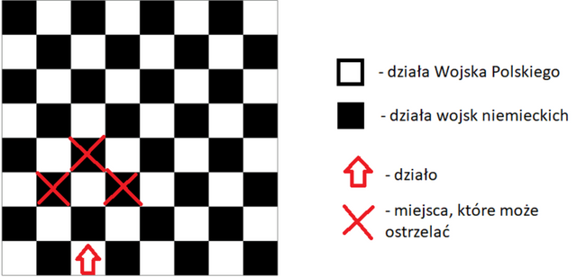

# Zadanie "Lekcja historii" (Hopcroft–Karp algorithm)

## Treść zadania

Alojzy zmęczony ciągłą pracą przy komputerze wybrał się na spacer do Ogrodu Saskiego. Zobaczył siedzącego na ławce starszego Pana, który ciągle mamrotał coś pod nosem, ściskając w dłoniach naszywkę Polski Walczącej. Nasz bohater zaciekawiony tą sytuacją wybrał się w kierunku wspomnianego mężczyzny. Zbliżając się ku niemu usłyszał, że ów mężczyzna powtarza “Artyleria… artyleria...”.

Alojzy wzniósł się na szczyty swojej odwagi i rozpoczął dialog ze starszym Panem. Był to były żołnierz, który walczył w bitwie pod Fajsławicami w dniu 26 września 1939 r. To dziwne pomyślał Alojzy, ponieważ hasło “bitwa pod Fajsławicami” kojarzyło się jedynie ze starciami z 24 sierpnia 1863 r. w czasie powstania styczniowego. Było to jedno z najkrwawszych starć wojsk powstańczych z armią rosyjską, dlatego tak mocno zakorzeniło się w pamięci mieszkańców gminy oraz całego województwa lubelskiego. Jednak bitwa, o której opowiadał staruszek, dotyczyła walk oddziałów niemieckich z Wojskiem Polskim. Precyzując, natarcia Niemców od strony Piask, podczas II wojny światowej. To wtedy polscy żołnierze zostali ostrzelani karabinami i artylerią od strony cmentarza wojennego z I wojny światowej, przy szosie na Piaski. Żołnierz wspomina, że mimo zwycięstwa w tej bitwie, wielu jego rówieśników w wieku 18 - 20 lat straciło życie, a ostrzał artyleryjski doprowadził do wybuchu wielu pożarów, które zniszczyły miasto.

Uczestnik wspomnianej bitwy miał ciągły żal do siebie i dowódcy kompanii por. Tadeusza Cesarza, że nie ograniczyli strat jakie poniosło miasto Fajsławice w wyniku ostrzału artyleryjskiego. Ów mężczyzna pokazał naszemu programiście swoje plany pola bitwy, działania, strategie, które ograniczyłyby straty ale nie miał sił już tego tłumaczyć. Westchnął… i odszedł, nieustannie powtarzając “Artyleria… artyleria..”.

Nasz bohater - wzrokowiec zapamiętał treści notatek żołnierza i zainteresowany całą tą historią doszedł do wniosku, że sam sprawdzi ile domostw, budynków dało się uratować. Aby się tego dowiedzieć musi znać ilość niezniszczonych dział, które pozostaną na polu bitwy po zastosowaniu strategii spotkanego Pana.

Dana jest siatka współrzędnych, przedstawiająca pole bitwy, o wymiarach N \* N (współrzędnie górnego-lewego rogu to (0,0), natomiast dolnego-prawego to (n - 1, n - 1). Zadanie polega na wyznaczeniu maksymalnej liczby dział, które można ustawić na polu bitwy w ten sposób, aby żadne działo nie mogło zestrzelić działa wojsk przeciwnych. Działa może ostrzelać tylko jedno z następujących pól: pole oddalone o 3 jednostki w linii prostej, przed sobą lub pole oddalone o 2 jednostki w linii prostej przed sobą i o jedną jednostkę w prawo, bądź lewo. Działa Wojska Polskiego znajdują się na polach o współrzędnych (NP, P), bądź (P, NP) i zwrócone są w kierunku północnym, zaś wojsk niemieckich (P, P) lub (NP, NP) i zwrócone są w kierunku południowym, gdzie P - to współrzędna parzysta, NP - współrzędna nieparzysta. (Rys. poglądowy poniżej).

## Wejście:

Algorytm na wejściu otrzymuje liczbę naturalną **N** i **M**, N mówi o wielkości pola bitwy, zaś M to liczba pól, gdzie znajdują się budynki i nie można postawić działa. Następnie program powinien wczytać **M sekwencji wartości X Y**, gdzie X i Y to liczby naturalne określające współrzędne miejsc na polu bitwy, gdzie nie można postawić działa.

**1 <= N, M, X, Y <= 1000000000**

## Wyjście:

Na wyjściu algorytm powinien wypisać maksymalną liczbę pól, który nie ulegną zniszczeniu.

### PRZYKŁADOWE DANE WEJŚCIOWE

```
5 3
2 0
2 1
2 3
```

### PRZYKŁADOWE DANE WYJŚCIOWE

```
19
```

### UWAGA

Algorytm powinien być samodzielną implementacją następującego algorytmów: Hopcrofta-Karp.

### RYSUNEK POMOCNICZY


