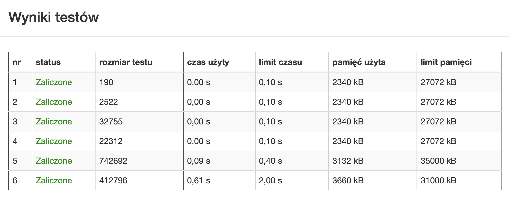

# Zadanie "Targi Tatuażu" (Binary search tree) 

## Treść zadania

W tym roku pierwszy Tattoo Konwent, który gościł także w Lublinie, odbywa się w Poznaniu 19-20.03.2022. Taki festiwal to doskonała okazja aby zrobić swój pierwszy lub kolejny tatuaż, zaczerpnąć inspiracji i poznać proces tatuowania.

Naszego bohatera tatuaże bardzo interesują, ale nigdy nie miał odwagi takowego zrobić. Alojzy ma istotne spotkanie biznesowe w tym terminie w Poznaniu. W związku z tym uznał, że to idealny moment, żeby wykonać pierwszy krok. Szerokie spektrum wspaniałych artystów bardzo przytłoczyło naszego bogatera i utrudnia mu podjęcie decyzji, którego artystę wybrać na autora swojego pierwszego tatuażu. Alojzy nie ma raczej duszy artysty, więc szybko problem sprowadził do natury statystycznej. Doszedł do wniosku, że powinien wybrać artystę, który zrobił najwięcej tatuaży oraz ma najlepszą średnią ocen na popularnym portalu społecznościowym. Niestety problem nie jest trywialny, ponieważ budżet jaki może na to przeznaczyć jest ograniczony, a lista dostępnych artystów często się zmienia. Pojawiają się nowe stoiska tatuażu, bądź brakuje już miejsc na już zarejestrowanych, co komplikuje znalezienie odpowiedniego artysty.

Po długich rozważaniach Alojzy doszedł do pewnych wniosków i uporządkował wszystkich artystów względem ceny tatuażu. Dodatkowo dla każdego z artystów obliczy jego współczynnik ‘atrakcyjności’, na podstawie dwóch wcześniej wspomnianych parametrów. Współczynnikiem była wartość: X / 5 * |_ Y / 1000 _|, gdzie X to średnia ocena, a Y ilość głosów. Teraz należało ograniczyć grupę artystów, do tych odpowiadających budżetowi i wymaganiom naszego programisty, tak by ułatwić ostateczny wybór.

## Wejście:
Algorytm na wejściu otrzymuje liczbę naturalną **N**, która mówi o ilości operacji naszego algorytmu. Operacje dzielimy na **A** oraz **S**.
**A** - jest to operacja dodania tatuażysty do naszej listy artystów. W tej operacji algorytm powinien wczytać sekwencję wartości **X** **Y** **Z** **S**, gdzie X jest liczbą rzeczywistą i Y to liczba naturalne określające parametry potrzebne do wyliczenia atrakcyjności oferty danego tatuażysty, Z to jego koszt, a S to jednowyrazowy pseudonim tatuażysty.\
**S** - jest to operacja wybierania tatuażysty. W tej operacji algorytm powinien wczytać również wartości, liczbę naturalną **B** oraz liczbę rzeczywistą **F**. B to ilość pieniędzy, jakie dokładnie chce wydać nasz student, zaś F to wartość współczynnik atrakcyjności, jaką co najmniej musi posiadać artysta, aby Alojzy był zadowolony z rezultatu procesu tatuowania.

**1 <= N <= 1000000000**\
**1 <= B, X, F, Y, Z <= 1000000**\
**Długość pseudonimu to maksymalnie 25 znaków.**

## Wyjście:
Dla każdej operacji S algorytm powinien wyświetlić odpowiedź:\
\- jeśli znalazł artystę, o cenie równej ilości pieniędzy, które posiada Alojzy oraz spełniającego wymagania ‘atrakcyjności’, program powinien wyświetlić pseudonim artysty i usunąć go z listy, w przypadku gdy jest kilku artystów o tej samej cenie tatuażu i oboje spełniają wymagania ‘atrakcyjności’ należy wybrać tego, który ma ten współczynnik większy, gdy wartość współczynnika dla kilku artystów jest taka sama decyduje to, który artysta później zadeklarował swoją obecność\
\- jeśli nie znalazł artysty spełniającego wymagania, program powinien wyświetlić ‘-’

### PRZYKŁADOWE DANE WEJŚCIOWE 
```
10
A 4.7 10100 400 Zbyszek
A 3.9 5000 200 Zbigniew
S 300 4.0
A 3.9 10000 200 Tomeczek
A 2.5 12345 123 Majami
S 200 8.0
A 5 20000 600 Kura
A 5 200 419 Zupa
A 4.8 10000 490 Barszczyk
S 200 4.0
```
### PRZYKŁADOWE DANE WYJŚCIOWE
```
-
-
Tomeczek
```

### UWAGA
Program powinien być samodzielną implementacją binarnego drzewa przeszukiwań (BST - Binary Search Tree).




