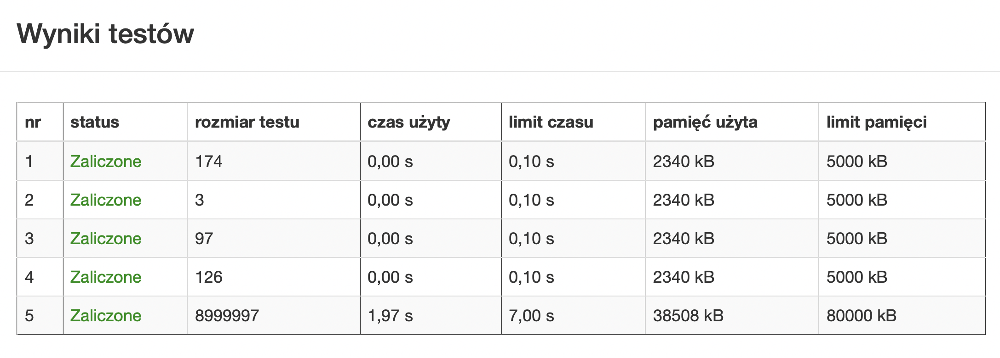

# Zadanie "Encyklopedia" (B-Tree)

## Treść zadania

Cyfryzacja danych jest powszechnym zjawiskiem. Praktycznie wszystkie dane przechowane są na dyskach twardych. Utworzenie takiego zbioru informacji i zachowanie go formie bajtów na dysku jest dużym wyzwaniem. Z kolei zlokalizowanie odpowiedniego klucza, hasła powinno być możliwie szybkie.

Alojzy czuje, że jego obowiązkiem jest zapewnić dostęp kolejnych pokoleń do zasobów wiedzy. W tym celu należy przygotować cyfrowe kompendium wiedzy zapisane w formie zbioru artykułów hasłowych, złożonych z haseł i tekstów je objaśniających. Hasła powinny być ułożone w pewnym logicznych porządku, dzięki czemu możliwe będzie szybkie odnalezienie właściwej informacji.\
Przygotuj algorytm, który zapewni optymalność zapisywania danych na dysku twardym. Rozwiązanie powinno umożliwić stworzenie haseł oraz ich wyszukiwanie i wyświetlanie tekstów objaśniających.

## Wejście:
W pierwszej linii wejścia znajduje się liczba naturalna **N**, a następnie w kolejnych **N** liniach jedna z dwóch następujących operacji:\
1\)  **hasło: objaśnienie**\
2\) **hasło**\
Operacja (1) zapisuje na dysku nowe hasło, wraz z jego objaśnieniem. Polecenie (2) jest zapytaniem o wybrane hasło.

**0 <= N <= 32000**

## Wyjście:
Dla każdego zapytania należy wypisać objaśnienie wyszukiwanego hasła lub słowo **BRAK**, jeśli takiego hasła brakuje w cyfrowej encyklopedii.

### PRZYKŁADOWE DANE WEJŚCIOWE 
```
6
Antylopa: Zamieszkuje Afryke i Azje.
Dzik euroazjatycki: Jest przodkiem swini domowej.
Dzik euroazjatycki
Kura
Kura domowa: Ptak hodowlany z rodziny kurowatych.
Kura domowa
```
### PRZYKŁADOWE DANE WYJŚCIOWE
```
Jest przodkiem swini domowej.
BRAK
Ptak hodowlany z rodziny kurowatych.
```

### UWAGA
Rozwiązanie powinno wykorzystywać samodzielną implementację B-drzew, gdzie parametr T charakterystyczny dla B-drzewa zawiera się w przedziale [10, 20].

