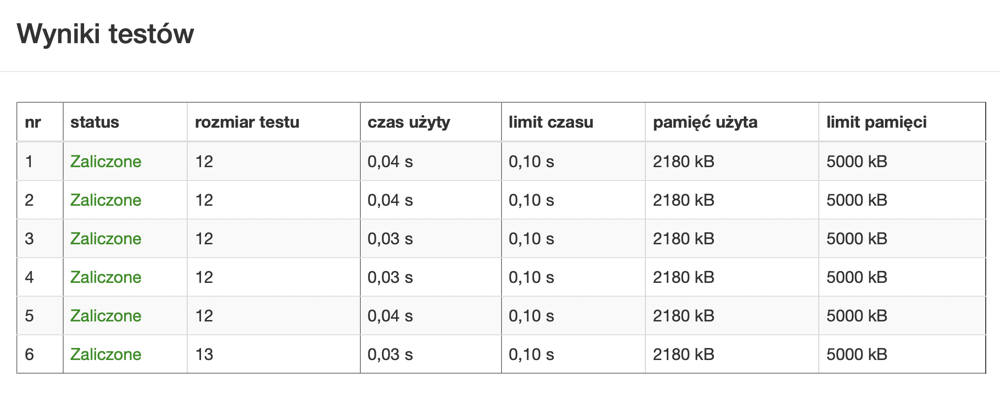

# Zadanie "Gdzie jest Grażyna" (Monte Carlo)

## Treść zadania

Grażyna, mama Alojzego, wyczytała w gazecie, że kuchnia to najbardziej prawdopodobne miejsce, gdzie można zastać statystyczną kobietę. Naszej bohaterce nie bardzo podoba się to stwierdzenie. W końcu uważa siebie za nowoczesną reprezentantkę tej płci, nie potrzebuje opinii innych, sama wie najlepiej, ile jest warta, gdzie spędza czas... no i ma smartfon! Doszła do wniosku, że osobiście zweryfikuje tą tezę. Chce sprawdzić z jakim prawdopodobieństwem można znaleźć ją w wybranych pomieszczeniach zacisza domowego, w określonym czasie. Dodatkowo ułatwi to rodzinie znalezienie kobiety, gdy będą mieli do niej jakąś bardzo ważną sprawę!

Nasz młody programista stwierdził, że pomoże swojej mamie. Napisz program, który obliczy prawdopodobieństwo znalezienie naszej bohaterki w określonych godzinach dla przedstawionych poniżej pomieszczeń:\
**0** - kuchnia,\
**1** - ogród,\
**2** - sypialnia,\
**3** - pokój rodzinny,\
**4** - łazienka,\
**5** - balkon.
## Wejście:
Program na wejście otrzymuje **dwie godziny w formacie HH:mm**, które mówią o przedziale czasowym do zweryfikowania, a następnie przyjmuje **numer pokoju**.

**0 < HH <= 24**\
**0 <= mm < 60**
## Wyjście:
Należy wypisać jakie jest prawdopodobieństwo pojawienia się Grażyny, w wybranym pomieszczeniu w danym przedziale czasowy. **Wynik powinien być podany z dokładnością do dwóch miejsc po przecinku**.

### PRZYKŁADOWE DANE WEJŚCIOWE 
```
8:00
22:00
0
```

### PRZYKŁADOWA FUNKCJA
```
int Grazyna(int HH, int mm){
	if(HH >= 8 && HH < 15) return 0;
	else if(HH >= 15 && HH < 22) return 1;
	return 2;
}
```

### PRZYKŁADOWE DANE WYJŚCIOWE
```
0.50
```

### UWAGA
Zadanie powinno być rozwiązane metodą Monte Carlo.

